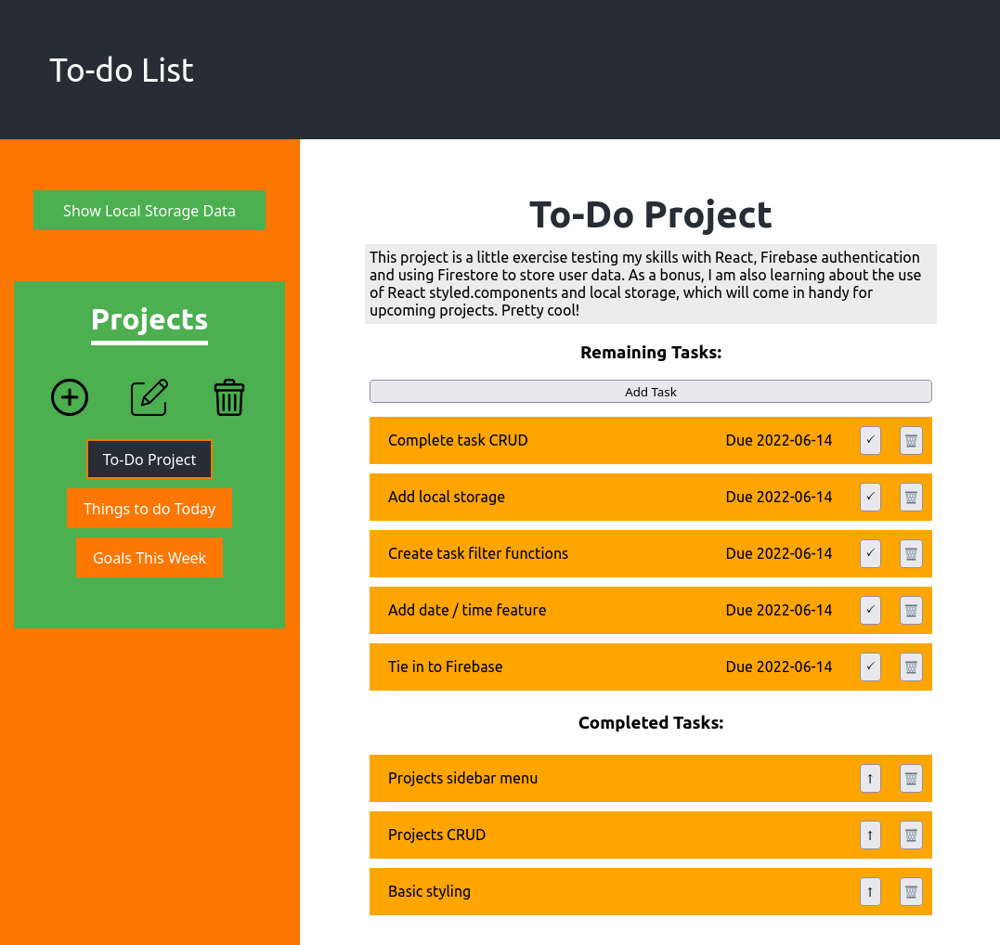

# ToDo List App

View the project live [here](https://brenton-j-andrews.github.io/todo_project/).

---
##### About this project  

Completed for [The Odin Project](https://www.theodinproject.com/lessons/node-path-javascript-todo-list) JavaScript course.

My take on the classic to do list project. This project contains sample data (as seen in the readme image) to give an idea of project functionality, and can also render data from local storage. Current functionality includes making and deleting projects, and making / deleting tasks associated with these projects. 

---
##### Frameworks

This project was built with React.

--- 
##### Takeaways
Many lessons learned via this project. I ended up implementing the local storage feature once everything else was completed, and am guessing that I could have integrated it in a much more efficient manner than I eneded up doing. I originally planned on connecting the project to Firebase but after completing localstorage and looking at the messy code I decided against it. The big lesson here was to list out desired project features at the beginning of the project and build it with the integration of these features in mind. Lesson learned!  

I also learned how to use React's styled components library. Seems pretty simple and fairly useful in some applications!

---
### ToDo's
- These are noted on the sample data 'To-Do Project' section and in the README image, check the [demo](https://brenton-j-andrews.github.io/todo_project/)!
